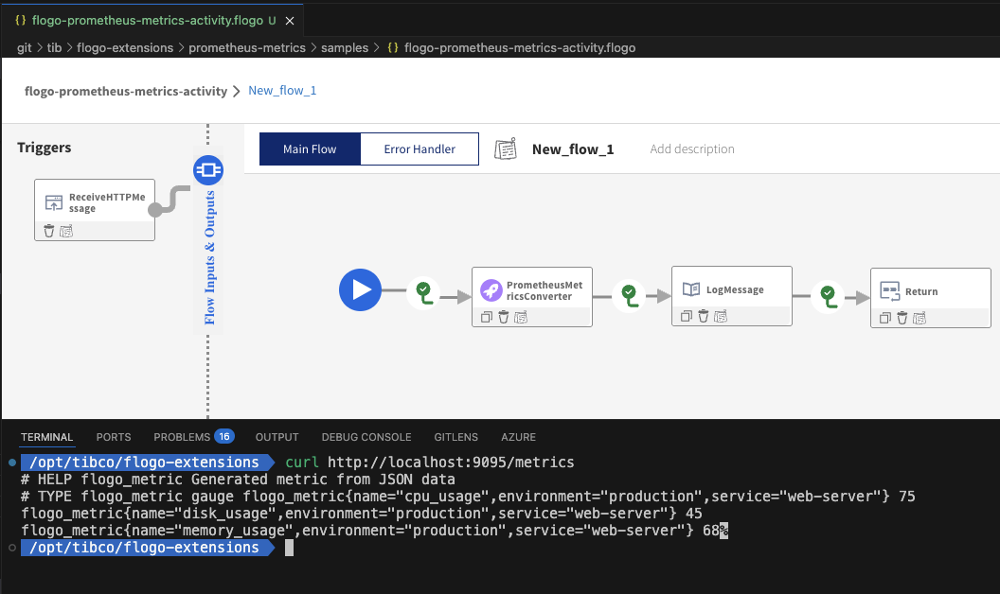
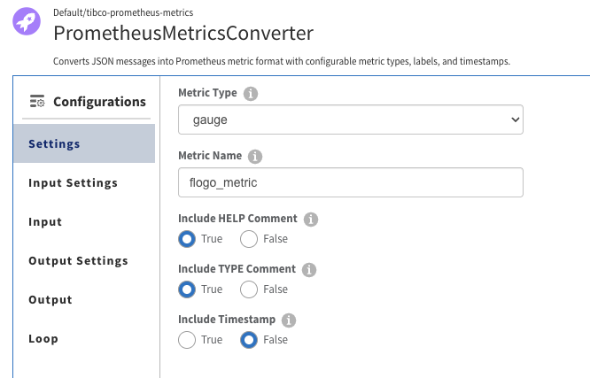
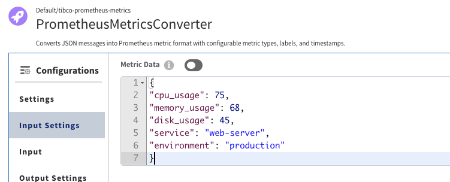
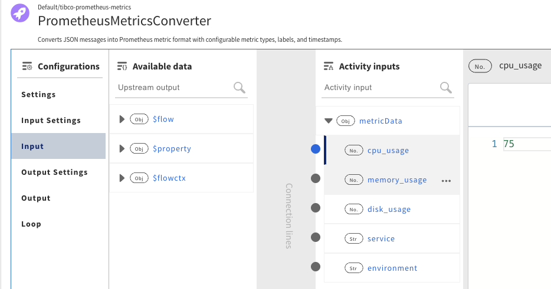
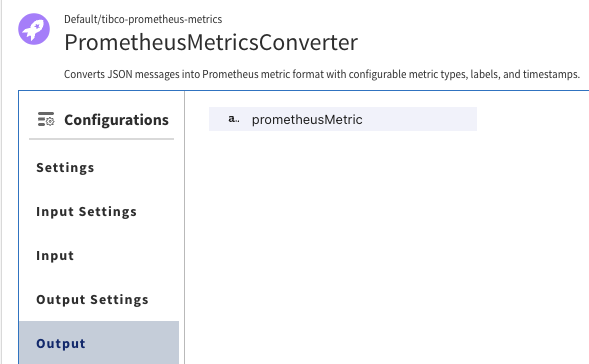

# Prometheus Metrics Activity for TIBCO Flogo

A powerful custom TIBCO Flogo activity that converts JSON data into Prometheus exposition format metrics. This activity automatically processes numeric fields from JSON input and generates properly formatted Prometheus metrics with multi-line output.

> **Important**: This activity generates **multiple metrics per JSON object**. Each numeric field becomes a separate metric line with a `name` label identifying the field. This differs from single-metric activities that create one metric per JSON object.

## 🎯 Key Features

- **Multiple Metrics Generation*## 📋 Quick Reference

### Build and Deploy Activity
```bash
./deploy.sh          # Complete deployment with guidance
./build.sh           # Build activity only
```

### Module Information
```
Module Path: github.com/kulbhushanbhalerao/flogo-extensions/prometheus-metrics
Activity ID: prometheus-metrics
Reference:   #prometheus-metrics
```

### Key Behavior
- **Multi-line Output**: Each numeric field generates a separate metric line
- **Name Labels**: Uses `name` labels (not `metric_name`) to identify different metrics
- **Automatic Processing**: All JSON numeric fields become individual metrics
- **Shared Labels**: Non-numeric fields become labels on all generated metrics

### Business Data Integration
- **Data Sources**: ActiveSpaces, Kafka, REST APIs, Databases, Files
- **Kubernetes Ready**: ServiceMonitor configuration for Prometheus scraping
- **Real-time Metrics**: Live business data exposure via `/metrics` endpoint
- **Multiple Patterns**: Topic subscribers, API aggregation, database queriesarate metrics for each numeric field in your JSON
- **Automatic Name Labels**: Each metric gets a `name` label with the JSON field name
- **Multiple Metric Types**: Support for gauge, counter, histogram, summary
- **Flexible Input**: Works with any JSON structure containing numeric values
- **Prometheus Compliant**: Properly formatted output ready for Prometheus ingestion
- **Label Sanitization**: Automatic sanitization of label names and values

## 🔄 How It Works

This activity converts JSON objects into **multiple Prometheus metrics** using the following behavior:

### Input Processing
- **Numeric Fields**: All numeric fields (integers, floats, or string numbers) become separate metrics
- **Name Labels**: Each metric gets a `name` label containing the original JSON field name
- **Other Fields**: Non-numeric fields become additional labels on all metrics

### Output Format
- **Multi-line Output**: Generates separate metric lines for each numeric field
- **Standard Format**: Follows Prometheus exposition format with HELP and TYPE comments
- **Consistent Labels**: All metrics from the same JSON object share the same non-numeric labels

### Example Conversion
**Input JSON:**
```json
{
  "cpu_usage": 75.2,
  "memory_usage": 68.5,
  "environment": "prod",
  "service": "web-server"
}
```

**Output:**
```prometheus
# HELP system_metrics Generated metric from JSON data
# TYPE system_metrics gauge
system_metrics{name="cpu_usage",environment="prod",service="web-server"} 75.2
system_metrics{name="memory_usage",environment="prod",service="web-server"} 68.5
```

## 📦 Installation

1. Install the activity using the Flogo CLI:
```bash
flogo install github.com/kulbhushanbhalerao/flogo-extensions/prometheus-metrics
```

2. Or add it to your `flogo.json` file:
```json
{
  "imports": [
    "github.com/kulbhushanbhalerao/flogo-extensions/prometheus-metrics"
  ]
}
```

## Screenshots







## ⚙️ Configuration

### Settings

| Setting | Type | Default | Description |
|---------|------|---------|-------------|
| **Metric Type** | string | `gauge` | Type of Prometheus metric (gauge, counter, histogram, summary) |
| **Metric Name** | string | `flogo_metric` | Base name for all generated metrics |
| **Include HELP** | boolean | `true` | Include HELP comment in output |
| **Include TYPE** | boolean | `true` | Include TYPE comment in output |
| **Include Timestamp** | boolean | `false` | Include timestamp in metric output |

### Input

| Field | Type | Description |
|-------|------|-------------|
| **Metric Data** | object | JSON object containing numeric fields to convert to metrics |

## 💡 How It Works

The activity can handle two types of input:

### Single Metric Object
Pass a single JSON object where:
- **Numeric fields** become separate metrics with a `metric_name` label
- **String fields** become labels applied to all metrics
- **Reserved fields** (help, timestamp, type) are handled specially

### Multiple Metrics Array
Pass a JSON object with a `metrics` array where each array element is a metric object processed as above.

## 📋 Usage Examples

### Example 1: Single Metric Object with Multiple Values

**Input JSON:**
```json
{
  "cpu_usage": 75.2,
  "memory_usage": 68.5,
  "service": "user-service",
  "environment": "prod",
  "region": "us-east"
}
```

**Settings:**
- Metric Type: `gauge`
- Metric Name: `system_metrics`

**Output:**
```prometheus
# HELP system_metrics Generated metric from JSON data
# TYPE system_metrics gauge
system_metrics{name="cpu_usage",environment="prod",region="us-east",service="user-service"} 75.2
system_metrics{name="memory_usage",environment="prod",region="us-east",service="user-service"} 68.5
```

### Example 2: Multiple Metric Objects

**Input JSON:**
```json
{
  "metrics": [
    {
      "value": 45,
      "service": "my-service",
      "environment": "prod",
      "region": "us-east"
    },
    {
      "value": 67,
      "service": "my-service",
      "environment": "prod", 
      "region": "us-west"
    }
  ]
}
```

**Settings:**
- Metric Type: `counter`
- Metric Name: `request_count`

**Output:**
```prometheus
# HELP request_count Generated metric from JSON data
# TYPE request_count counter
request_count{name="value",environment="prod",region="us-east",service="my-service"} 45
request_count{name="value",environment="prod",region="us-west",service="my-service"} 67
```

### Example 3: Mixed Data Types

**Input JSON:**
```json
{
  "temperature": 23.5,
  "humidity": "65",
  "pressure": 1013,
  "location": "room_a",
  "sensor_id": "temp_001",
  "status": "online"
}
```

**Output:**
```prometheus
# HELP sensor_reading Generated metric from JSON data
# TYPE sensor_reading gauge
sensor_reading{name="humidity",location="room_a",sensor_id="temp_001",status="online"} 65
sensor_reading{name="pressure",location="room_a",sensor_id="temp_001",status="online"} 1013
sensor_reading{name="temperature",location="room_a",sensor_id="temp_001",status="online"} 23.5
```

## Data Processing Rules

### Numeric Field Detection
The activity automatically detects numeric values from:
- Direct numeric types (int, float)
- String values that can be parsed as numbers (e.g., "45", "23.5")

### Label Creation  
- All non-numeric, non-reserved fields become labels
- Label names are sanitized for Prometheus compliance
- Label values are properly escaped
- Labels are sorted alphabetically for consistent output

### Reserved Fields
The following fields are treated specially:
- `help` - Used for HELP comment
- `timestamp` - Used for timestamp  
- `type` - Reserved
- Built-in metric fields are processed as metrics, not labels

## Integration Patterns

### Single Metrics
Use when you have one measurement with multiple dimensions:
```json
{
  "response_time": 150,
  "service": "api",
  "endpoint": "/users"
}
```

### Multiple Metrics
Use when you have multiple related measurements:
```json
{
  "metrics": [
    {"cpu": 75, "host": "server1"},
    {"cpu": 68, "host": "server2"}
  ]
}
```
## Error Handling

- **No Numeric Fields Found**: The activity returns an error with a list of available fields in the input JSON.
- **Invalid JSON Input**: Gracefully handled with descriptive error messages to help identify the issue.
- **Missing Settings**: Sensible defaults are applied, such as using `gauge` as the metric type and standard naming conventions.
- **Invalid Array Format**: Individual invalid metrics are skipped, while valid ones are processed without interruption.

## Output Format

The activity generates metrics in the standard Prometheus exposition format:
```
# HELP <metric_name> <help_text>
# TYPE <metric_name> <metric_type>
<metric_name>{<labels>} <value> [<timestamp>]
```

### Example Output
```prometheus
# HELP system_metrics Generated metric from JSON data
# TYPE system_metrics gauge
system_metrics{name="cpu_usage",environment="prod",service="web-server"} 75.2
system_metrics{name="memory_usage",environment="prod",service="web-server"} 68.5
```

## Integration with Prometheus

The generated output can be integrated with Prometheus in the following ways:
- **Prometheus Pushgateway**: Push metrics directly to a Pushgateway instance.
- **HTTP Endpoint**: Serve metrics via an HTTP endpoint for Prometheus scraping.
- **File Export**: Write metrics to a file for Prometheus to collect using `file_sd_config`.
- **Remote Write**: Send metrics to Prometheus-compatible systems using remote write protocols.

## Dependencies

- **TIBCO Flogo Core**: Version 1.2.0 or higher.
- **Go**: Version 1.19 or higher.

### Example 4: With Timestamps

**Input JSON:**
```json
{
    "response_time": 125.5,
    "requests_per_sec": 45,
    "timestamp": 1705316200000
}
```

**Settings:**
- Metric Type: `gauge`
- Metric Name: `web_metrics`
- Include Timestamp: `true`

**Output:**
```prometheus
# HELP web_metrics Generated metric from JSON data
# TYPE web_metrics gauge
web_metrics{name="requests_per_sec"} 45 1705316200000
web_metrics{name="response_time"} 125.5 1705316200000
```

## 🔧 Field Processing Rules

### Numeric Fields → Metrics
- **Integers**: `1`, `100`, `-50` → Become metric values
- **Floats**: `23.5`, `3.14159`, `0.001` → Become metric values
- **String Numbers**: `"42"`, `"3.14"` → Automatically converted to numeric values

### Non-Numeric Fields → Ignored
- **Strings**: `"hello"`, `"production"` → Skipped (not converted to metrics)
- **Booleans**: `true`, `false` → Skipped
- **Objects/Arrays**: `{}`, `[]` → Skipped

### Reserved Fields
These fields are treated specially and not converted to metrics:
- `help` → Used for HELP comment text
- `timestamp` → Used for timestamp value
- `type` → Reserved field

## 🏷️ Label Sanitization

Field names are automatically sanitized to comply with Prometheus label naming rules:
- Must start with letter or underscore: `123field` → `_23field`
- Only letters, numbers, underscores allowed: `field-name` → `field_name`
- Spaces replaced with underscores: `field name` → `field_name`

## 🔗 Integration Examples

### With Prometheus Pushgateway
```go
// Use the activity output to push to Pushgateway
prometheusOutput := activityOutput.PrometheusMetric
http.Post("http://pushgateway:9091/metrics/job/flogo-app", "text/plain", strings.NewReader(prometheusOutput))
```

### With File Export
```go
// Write metrics to file for Prometheus file_sd_config
os.WriteFile("/var/lib/prometheus/flogo-metrics.prom", []byte(activityOutput.PrometheusMetric), 0644)
```

### With HTTP Endpoint
```go
// Serve metrics via HTTP endpoint
http.HandleFunc("/metrics", func(w http.ResponseWriter, r *http.Request) {
    w.Header().Set("Content-Type", "text/plain")
    w.Write([]byte(activityOutput.PrometheusMetric))
})
```

## 🛠️ Building and Deployment

### Quick Deployment (Recommended)
```bash
# Complete build and deployment guidance
./deploy.sh
```

This script will:
1. Build the activity
2. Clean Go module cache
3. Check for Flogo applications that need rebuilding
4. Provide specific rebuild instructions

### Quick Build
```bash
# Build just the activity
./build.sh
```

### Manual Build Steps
```bash
# Download dependencies
go mod tidy

# Build the activity
go build -v .

# Run tests (optional)
go test -v
```

### Flogo Application Integration

#### Step 1: Update Your Activity Code
If you made changes to the activity, ensure they're saved and built:

```bash
cd /path/to/prometheus-metrics
go build
```

#### Step 2: Clear Go Module Cache
To ensure Flogo picks up the latest activity version:

```bash
go clean -modcache
```

#### Step 3: Rebuild Flogo Application
Depending on your setup:

**If using Flogo CLI:**
```bash
# Navigate to your app directory
cd /path/to/your/flogo/app

# Rebuild the application
flogo build -f your-app.flogo
```

**If using development environment:**
- Stop the current Flogo application completely
- Clear any build cache in your development environment
- Restart/rebuild the application

**If using a compiled binary:**
```bash
# Remove the old binary
rm bin/your-flogo-app

# Rebuild using your development environment or CI/CD pipeline
```

#### Step 4: Restart Application
```bash
# If using the compiled binary
./bin/your-flogo-app

# If using flogo run
flogo run
```

### Troubleshooting Build Issues

#### Activity Not Recognized
**Problem**: `failed to resolve activity attr: 'prometheusMetric', not found`

**Solution**:
1. Ensure the activity is properly built: `go build`
2. Clear module cache: `go clean -modcache`
3. Rebuild the entire Flogo application
4. Restart the application completely

#### Module Import Issues
**Problem**: Import path not found

**Solution**:
1. Verify the module name in `go.mod` matches the import in your `.flogo` file
2. Ensure the activity directory is accessible to the Flogo build process
3. Check that all dependencies are available: `go mod tidy`

#### Build Cache Issues
**Problem**: Changes not reflected in running application

**Solution**:
```bash
# Clean everything
go clean -cache -modcache
cd prometheus-metrics && go build
# Then rebuild your Flogo application
```

### Development Workflow

1. **Make Changes**: Edit `activity.go` or other source files
2. **Test**: Run `go test -v` to verify changes
3. **Build Activity**: Run `./build.sh` or `go build`
4. **Clean Cache**: Run `go clean -modcache`
5. **Rebuild App**: Rebuild your Flogo application
6. **Restart**: Restart the Flogo application to pick up changes

### Verification

After rebuilding and restarting, verify the activity is working:

1. **Check Logs**: Look for DEBUG statements from the activity
2. **Validate Output**: Ensure metrics are generated correctly
3. **Test Flow**: Run your flow and check the output format

Example expected log output:
```
DEBUG: Processing single metric object
DEBUG: Processing field 'cpu_usage' with value '75'
DEBUG: Generated labels: 'name="cpu_usage",environment="prod",service="web-server"'
DEBUG: Final result from processMetricObject: '...'
```

## 🔧 Activity Configuration

### In Flogo Flow JSON
```json
{
  "activity": {
    "ref": "github.com/kulbhushanbhalerao/flogo-extensions/prometheus-metrics",
    "settings": {
      "metricType": "gauge",
      "metricName": "my_metric",
      "includeHelp": true,
      "includeType": true,
      "timestamp": false
    },
    "input": {
      "metricData": "=$flow.body"
    }
  }
}
```

## 📊 Real-World Use Cases

### 1. Business Data Metrics API
**Scenario**: Expose business metrics from various data sources via a `/metrics` endpoint for Prometheus scraping.

**Architecture Flow**:
```
Data Sources → Flogo Flow → Prometheus Activity → /metrics API → Prometheus Scraper
```

**Supported Data Sources**:
- **TIBCO ActiveSpaces**: Real-time in-memory data grid
- **Message Topics**: Kafka, TIBCO EMS, RabbitMQ subscribers
- **REST APIs**: External service calls, microservice endpoints
- **Databases**: SQL Server, PostgreSQL, Oracle via JDBC connectors
- **Files**: CSV, JSON, XML processors
- **Custom Connectors**: Any TIBCO Flogo plugin/connector

### 2. IoT Sensor Data
Convert sensor readings (temperature, humidity, pressure) into individual metrics

### 3. Application Performance
Monitor different performance counters (CPU, memory, network) as separate metrics

### 4. System Monitoring
Convert system stats into multiple Prometheus metrics for dashboarding

## 🏢 Business Data Metrics Patterns

### Pattern 1: ActiveSpaces Real-Time Metrics
Expose live business data from TIBCO ActiveSpaces as Prometheus metrics.

**Flogo Flow Design**:
```json
{
  "name": "business-metrics-api",
  "triggers": [{
    "id": "rest_trigger",
    "ref": "github.com/project-flogo/contrib/trigger/rest",
    "settings": {
      "port": 8080
    },
    "handlers": [{
      "settings": {
        "method": "GET",
        "path": "/metrics"
      },
      "action": {
        "ref": "github.com/project-flogo/flow",
        "settings": {
          "flowURI": "res://flow:business_metrics"
        }
      }
    }]
  }],
  "resources": [{
    "id": "flow:business_metrics",
    "data": {
      "flow": {
        "tasks": [
          {
            "id": "activespaces_query",
            "name": "Query ActiveSpaces",
            "activity": {
              "ref": "github.com/tibco-software/flogo-contrib/activity/activespaces",
              "input": {
                "spaceName": "BusinessData",
                "operation": "GET_ALL"
              }
            }
          },
          {
            "id": "transform_data",
            "name": "Transform to Metrics Format",
            "activity": {
              "ref": "github.com/project-flogo/contrib/activity/actreturn",
              "input": {
                "mappings": {
                  "total_orders": "=$activity[activespaces_query].result.orderCount",
                  "revenue_usd": "=$activity[activespaces_query].result.totalRevenue",
                  "active_customers": "=$activity[activespaces_query].result.customerCount",
                  "region": "us-west",
                  "environment": "production"
                }
              }
            }
          },
          {
            "id": "prometheus_convert",
            "name": "Convert to Prometheus Format",
            "activity": {
              "ref": "github.com/kulbhushanbhalerao/flogo-extensions/prometheus-metrics",
              "settings": {
                "metricType": "gauge",
                "metricName": "business_metrics",
                "includeHelp": true,
                "includeType": true
              },
              "input": {
                "metricData": "=$activity[transform_data].result"
              }
            }
          }
        ]
      }
    }
  }]
}
```

**Expected Output** (`GET /metrics`):
```prometheus
# HELP business_metrics Generated metric from JSON data
# TYPE business_metrics gauge
business_metrics{name="active_customers",environment="production",region="us-west"} 1250
business_metrics{name="revenue_usd",environment="production",region="us-west"} 45678.90
business_metrics{name="total_orders",environment="production",region="us-west"} 892
```

### Pattern 2: Topic Subscriber Metrics
Subscribe to message topics and expose aggregated metrics.

**Use Case**: Monitor real-time order processing metrics from Kafka topics.

**Flow Tasks**:
1. **Kafka Subscriber** → Receive order events
2. **Aggregator** → Calculate metrics (orders/min, avg order value)
3. **Prometheus Converter** → Format as metrics
4. **REST Endpoint** → Expose via `/metrics`

**Sample Data Flow**:
```json
// Incoming Kafka message
{
  "orderId": "ORD-12345",
  "amount": 89.99,
  "currency": "USD",
  "customerId": "CUST-789",
  "timestamp": 1642694400000
}

// Aggregated metrics data
{
  "orders_per_minute": 15,
  "average_order_value": 67.45,
  "total_revenue_last_hour": 3456.78,
  "unique_customers": 42,
  "service": "order-processor",
  "region": "us-east"
}

// Prometheus output
business_metrics{name="orders_per_minute",region="us-east",service="order-processor"} 15
business_metrics{name="average_order_value",region="us-east",service="order-processor"} 67.45
business_metrics{name="total_revenue_last_hour",region="us-east",service="order-processor"} 3456.78
business_metrics{name="unique_customers",region="us-east",service="order-processor"} 42
```

### Pattern 3: REST API Data Aggregation
Fetch data from multiple REST APIs and expose combined metrics.

**Scenario**: Monitor SLA metrics across multiple microservices.

**Flow Design**:
```
[Timer Trigger] → [API Call 1] → [API Call 2] → [API Call 3] → [Data Merger] → [Prometheus Converter] → [Cache/Store]
                                                                                                           ↓
[REST Trigger: /metrics] ← [Return Cached Metrics]
```

**Implementation**:
1. **Setup Timer Trigger**: Configure periodic data collection (e.g., every 30 seconds)
2. **Fetch Data Sources**: Make parallel REST calls to multiple microservice endpoints
3. **Data Aggregation**: Combine responses and calculate derived metrics (averages, totals, rates)
4. **Transform to Metrics**: Map aggregated data to Prometheus-compatible JSON structure
5. **Convert with Activity**: Use prometheus-metrics activity to generate exposition format
6. **Cache Results**: Store formatted metrics for `/metrics` endpoint consumption
7. **Expose via REST**: Serve cached metrics through HTTP GET `/metrics` endpoint

### Pattern 4: Database Query Metrics
Transform database query results into Prometheus metrics.

**Use Case**: Expose database health and business KPIs.

**SQL Query Example**:
```sql
SELECT 
    COUNT(*) as total_users,
    SUM(CASE WHEN status='active' THEN 1 ELSE 0 END) as active_users,
    AVG(login_frequency) as avg_login_frequency,
    COUNT(DISTINCT region) as regions_count
FROM users 
WHERE created_date >= DATE_SUB(NOW(), INTERVAL 24 HOUR)
```

**Flogo Transformation**:
```json
{
  "id": "db_to_metrics",
  "activity": {
    "ref": "github.com/kulbhushanbhalerao/flogo-extensions/prometheus-metrics",
    "input": {
      "metricData": {
        "total_users": 15420,
        "active_users": 12890,
        "avg_login_frequency": 3.2,
        "regions_count": 8,
        "data_source": "user_database",
        "query_time": "2024-01-15T10:30:00Z"
      }
    }
  }
}
```

## 🚢 Kubernetes Deployment & Prometheus Integration

### ServiceMonitor Configuration
Create a Kubernetes ServiceMonitor to enable Prometheus scraping of your Flogo metrics endpoint.

**Step 1: Deploy Flogo Application**
```yaml
apiVersion: apps/v1
kind: Deployment
metadata:
  name: flogo-business-metrics
  labels:
    app: flogo-business-metrics
    version: v1.0.0
spec:
  replicas: 2
  selector:
    matchLabels:
      app: flogo-business-metrics
  template:
    metadata:
      labels:
        app: flogo-business-metrics
    spec:
      containers:
      - name: flogo-app
        image: your-registry/flogo-business-metrics:latest
        ports:
        - containerPort: 8080
          name: http
        env:
        - name: ACTIVESPACES_HOST
          value: "activespaces-service:8080"
        resources:
          requests:
            memory: "128Mi"
            cpu: "100m"
          limits:
            memory: "256Mi"
            cpu: "200m"
---
apiVersion: v1
kind: Service
metadata:
  name: flogo-business-metrics-service
  labels:
    app: flogo-business-metrics
spec:
  selector:
    app: flogo-business-metrics
  ports:
  - port: 8080
    targetPort: 8080
    name: http
```

**Step 2: Create ServiceMonitor**
```yaml
apiVersion: monitoring.coreos.com/v1
kind: ServiceMonitor
metadata:
  name: flogo-business-metrics-monitor
  namespace: monitoring  # Adjust based on your Prometheus operator namespace
  labels:
    app: flogo-business-metrics
    prometheus: kube-prometheus  # Matches your Prometheus selector
spec:
  selector:
    matchLabels:
      app: flogo-business-metrics
  endpoints:
  - port: http
    path: /metrics
    interval: 30s
    scrapeTimeout: 10s
    honorLabels: true
  namespaceSelector:
    matchNames:
    - default  # Namespace where your Flogo app is deployed
```

**Step 3: Prometheus Rule (Optional)**
```yaml
apiVersion: monitoring.coreos.com/v1
kind: PrometheusRule
metadata:
  name: flogo-business-alerts
  namespace: monitoring
spec:
  groups:
  - name: business-metrics
    rules:
    - alert: LowOrderRate
      expr: business_metrics{name="orders_per_minute"} < 5
      for: 5m
      labels:
        severity: warning
      annotations:
        summary: "Order rate is below threshold"
        description: "Order processing rate has been below 5 orders/minute for 5 minutes"
    
    - alert: HighResponseTime
      expr: microservice_sla_metrics{name="user_service_response_time"} > 500
      for: 2m
      labels:
        severity: critical
      annotations:
        summary: "User service response time is high"
        description: "User service response time is {{ $value }}ms"
```

### Grafana Dashboard Query Examples
Use these PromQL queries in Grafana to visualize your business metrics:

```promql
# Business metrics over time
rate(business_metrics{name="total_orders"}[5m])

# Service health comparison
microservice_sla_metrics{name=~".*_response_time"}

# Revenue trends
increase(business_metrics{name="revenue_usd"}[1h])

# Customer engagement
business_metrics{name="active_customers"} / business_metrics{name="total_users"} * 100
```

### Health Check Integration
Add health check endpoints to your Flogo application:

```json
{
  "path": "/health",
  "method": "GET",
  "activity": {
    "ref": "github.com/project-flogo/contrib/activity/actreturn",
    "input": {
      "mappings": {
        "status": "healthy",
        "timestamp": "=$env[CURRENT_TIME]",
        "version": "v1.0.0"
      }
    }
  }
}
```

This comprehensive setup enables:
- **Real-time monitoring** of business data from various sources
- **Automated alerting** based on business metrics thresholds  
- **Historical analysis** and trending via Prometheus/Grafana
- **Scalable architecture** with Kubernetes orchestration
- **High availability** with multiple Flogo replicas

## 🚨 Error Handling

- **No Numeric Fields**: Activity succeeds but produces only HELP/TYPE comments (no metric lines)
- **Invalid JSON**: Activity returns error with descriptive message
- **Invalid Settings**: Uses sensible defaults

## 📋 Requirements

- TIBCO Flogo Core v1.2.0+
- Go 1.19+

## � Quick Reference

### Build and Deploy Activity
```bash
./deploy.sh          # Complete deployment with guidance
./build.sh           # Build activity only
```

### Module Information
```
Module Path: github.com/kulbhushanbhalerao/flogo-extensions/prometheus-metrics
Activity ID: prometheus-metrics
Reference:   #prometheus-metrics
```

### Common Commands
```bash
# Clean build everything
go clean -cache -modcache && go build

# Test the activity
go test -v

# Remove old Flogo binary (replace with your app name)
rm ../../bin/your-flogo-app

# Check activity is working (look for these in logs)
"DEBUG: Processing field 'field_name' with value 'value'"
"DEBUG: Number of metric lines generated: X"
```

### Expected Output Format
```prometheus
# HELP metric_name Generated metric from JSON data
# TYPE metric_name gauge
metric_name{name="field1",label1="value1"} 123
metric_name{name="field2",label1="value1"} 456
```
**Note**: Each numeric field generates a separate metric line with a `name` label

### Troubleshooting
- **Field not found**: Rebuild Flogo application completely
- **No DEBUG logs**: Activity not updated, clean cache and rebuild
- **Single metric only**: Check input JSON has multiple numeric fields

### Kubernetes Troubleshooting
- **ServiceMonitor not found**: Check Prometheus operator labels and namespace
- **Metrics not scraped**: Verify `/metrics` endpoint returns 200 OK status
- **No data in Prometheus**: Check ServiceMonitor `interval` and `scrapeTimeout` settings
- **Connection refused**: Ensure Flogo service port matches ServiceMonitor target port

## �📄 License

Keep only this repo as a source for any enhancements or create a PR for this repo. 
